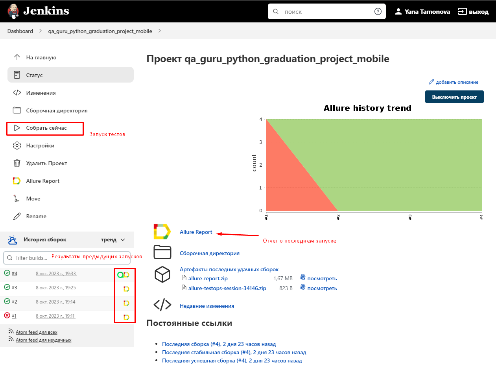
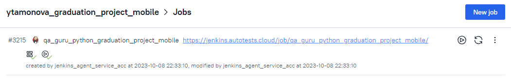
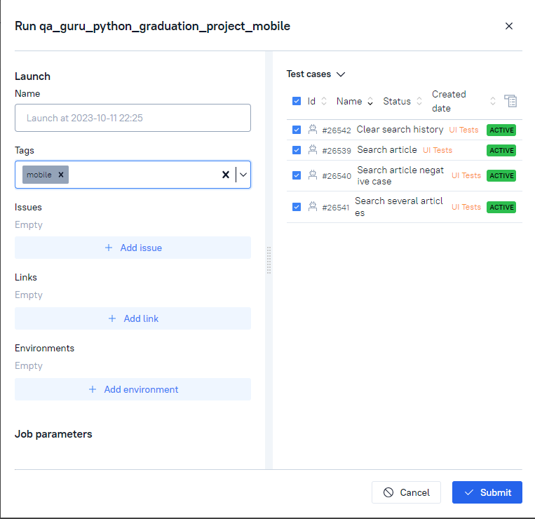
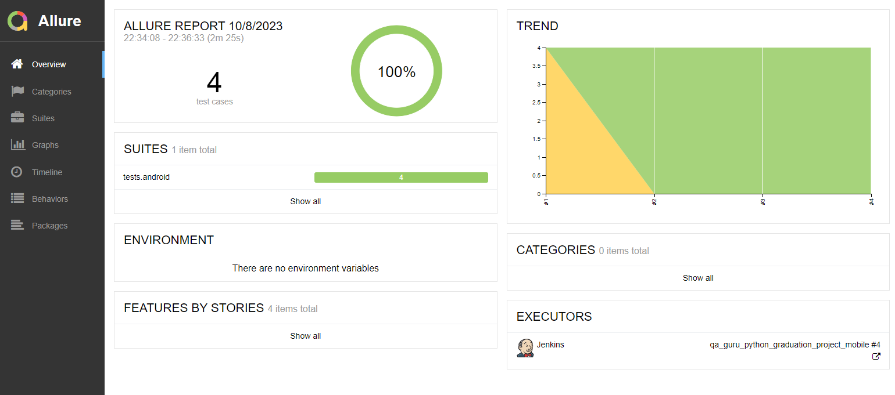
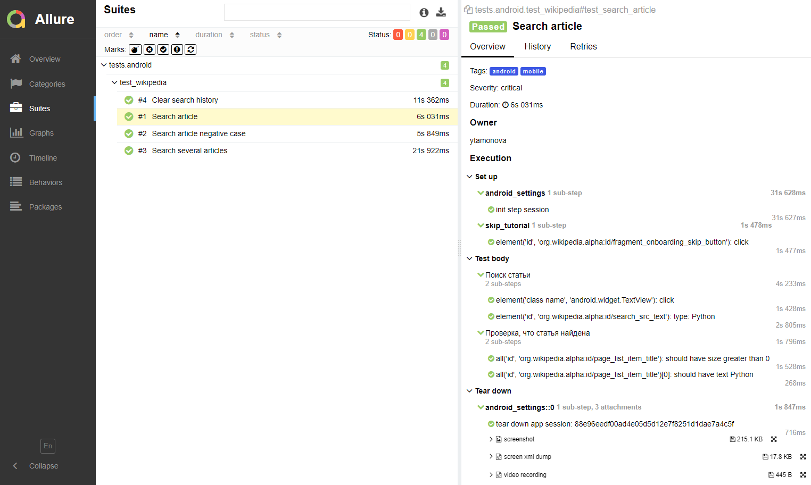
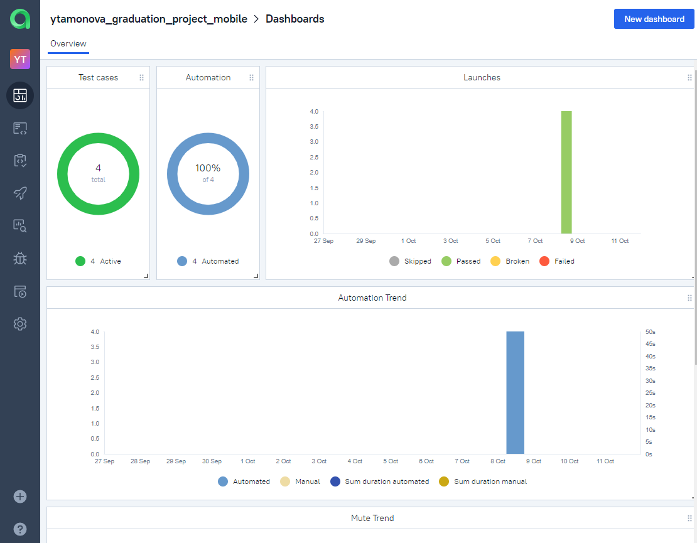
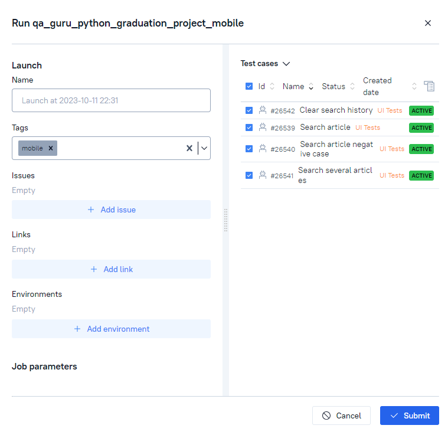
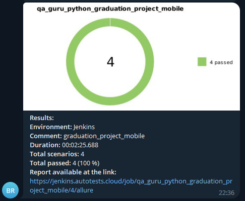

## Пример проекта с автотестами для [мобильного приложения Wikipedia](https://github.com/wikimedia/apps-android-wikipedia/releases/download/latest/app-alpha-universal-release.apk) на Android 

<p align="center">
    &nbsp;
</p>

## Используемые технологии
<p>
<a href="https://www.python.org/"></a>
<a href="https://docs.pytest.org/en/"></a>
<a href="https://www.jetbrains.com/pycharm/"></a>
<a href="https://www.selenium.dev/"></a>
<a href="https://github.com/yashaka/selene/"></a>
<a href="https://aerokube.com/selenoid/"></a>
<a href="https://appium.io/"></a>
<a href="https://www.browserstack.com/"></a>
<a href="https://docs.pydantic.dev/latest/"></a>
<a href="https://github.com/"></a>
<a href="https://www.jenkins.io/"></a>
<a href="https://allurereport.org/"></a>
<a href="https://qameta.io/"></a>
<a href="https://telegram.org/"></a>
</p>

## Android тесты:
Были реализованы следующие тесты:
* Поиск существующей статьи
* Поиск несуществующей статьи
* Переход по нескольким статьям
* Удаление истории поиска

 Пример запущенного теста (Поиск статьи):
<p align="center">
    &nbsp;
</p>

## Запуск тестов

## Для удалённого запуска на BrowserStack необходимо:
1. Быть зарегистрированным на Browserstack
2. В файле .env.credentials указать 
* browserstack_username
*browserstack_accesskey
3. В файле env.bstack указать необходимые параметры для запуска 
4. При запуске в терминале указать команду "context=bstack pytest ."

### Для локального запуска на эмуляторе: 
1. Установить Java SDK, сервер Appium
2. Создать и запустить эмулятор (проверить, что устройство запущено можно командой "adb devices" в командной строке)
3. Запустить сервер appium
4. В файле .env.local_emulator указать необходимые параметры для запуска
5. При запуске в терминале указать команду "context=local_emulator pytest ."

### Для локального запуска на реальном устройстве: 
1. Установить Java SDK, сервер Appium
2. Подключить и настроить реальное устройство к ПК (проверить, что устройство запущено можно командой "adb devices" в командной строке)
3. Запустить сервер appium
4. В файле .env.local_real указать необходимые параметры для запуска
5. При запуске в терминале указать команду "context=local_real pytest ."

### Для запуска тестов из [Jenkins](https://jenkins.autotests.cloud/job/qa_guru_python_graduation_project_mobile/):
Для запуска тестов из **Jenkins** нажмите «Собрать сейчас».

&nbsp;

### Для запуска тестов из [Allure Test Ops](https://allure.autotests.cloud/project/3711):
Реализована интеграция с **Allure Test Ops**, откуда напрямую можно запускать тесты. В **Allure Test Ops** также есть возможность настраивать параметры запуска, выбирая конкретные тестовые случаи.

&nbsp;
&nbsp;

## Отчет о пройденных тестах в [Allure Report](https://jenkins.autotests.cloud/job/qa_guru_python_graduation_project_mobile/allure/) и тестовая документация:

### Локальный запуск тестов

Для MacOS введите в терминале команду 
```
allure serve allure-results
``` 
Для Windows введите в терминале команду 
```
allure.bat serve allure-results
``` 

### Запуск тестов из Jenkins или Allure Test Ops

**Allure Report** можно открыть на странице Jenkins (см. скриншот Jenkins в разделе выше) и содержит графику, детализацию выполнения тестов, различные виды вложений (скриншоты, дампы, видео и т.д.).
&nbsp;
&nbsp;

**Allure Test Ops** также содержит информацию о прохождении и создает тестовую документацию.
&nbsp;
&nbsp;

## Нотификация о прохождении тестов

После выполнения тестового запуска будет отправлено телеграмм-сообщение со следующей информацией:
* общее количество тестов и продолжительность выполнения
* процент пройденных/неудачных/пропущенных/и т.д. тестов
* ссылка на allure отчет

<p align="center">
&nbsp;
</p>

Для отправки сообщений в телеграм была использована [notifications library](https://github.com/qa-guru/allure-notifications), создан и добавлен в чат телеграм бот.